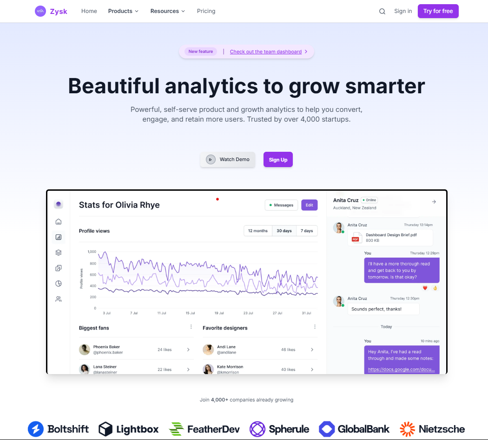

# Zysk Technologies React Interface

This repository contains the premium and responsive webpage developed as part of the assignment for the **Zysk Technologies** selection procedure. The interface was designed by referring to the provided Figma design, and additional changes and improvements have been added to enhance the overall quality and user experience.

## Demo

You can view the live demo of the website hosted on [Vercel](https://zysk-react-interface.vercel.app).

## Screenshot

### Desktop View



## Design Reference

The design was created using the provided Figma link:  
[Figma Design](https://www.figma.com/file/6V9PukAvgwAWA35uHV5l6b/React-Assignment?type=design&node-id=1-18169&mode=design&t=42U9hcbPpiTnr6Ql-11)

## Features

- **Responsive Layout**: The website is fully responsive, ensuring optimal display across devices (desktop, tablet, mobile).
- **CSS Framework**: Integrated with a CSS framework (e.g., Bootstrap, Tailwind CSS) for styling and layout.
- **User Interface**: The design closely follows the provided Figma wireframe with additional enhancements for a polished final look.
  
## Technologies Used

- **React**: For building the user interface and handling component-based development.
- **CSS Framework**: Tailwind CSS , Vanilla CSS.
- **Vercel**: For hosting the website and providing a live demo.

## Setup Instructions

To run this project locally:

1. Clone this repository:
   ```bash
   git clone https://github.com/yourusername/zysk-react-interface.git
   ```

2. Navigate into the project directory:
   ```bash
   cd zysk-react-interface
   ```

3. Install the required dependencies:
   ```bash
   npm install
   ```

4. Start the development server:
   ```bash
   npm start
   ```

5. Open your browser and visit `http://localhost:3000` to view the project locally.

## Conclusion

This project is a demonstration of how a Figma design can be translated into a fully functional, responsive React web application. The added improvements ensure a high-quality user interface with an intuitive layout, making it suitable for a variety of devices and screen sizes.

---

**Note**: Please refer to the Figma design and check the provided screenshot for a better understanding of the project layout and responsiveness.
